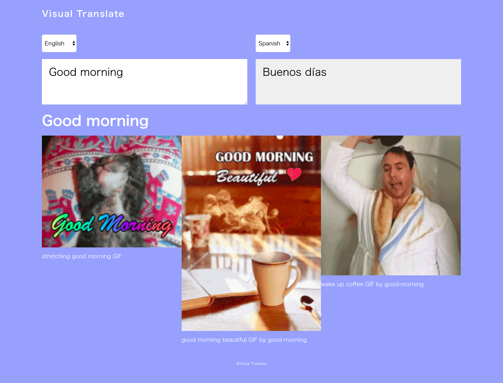

# Visual Translate

> Visual Translate is the web site to give you the service for not only translating but also showing you Giphy image for visualizing the searched keyword.



## Table of contents

- [Description](#Description)
- [Getting started](#Getting-started)
- [Features](#Features)
- [Status](#Status)
- [Links](#Links)
- [Contact](#Contact)

## Description

- Visual Translate is a simple translate service using 2 API, Google Translate API and Giphy API.

- Depends on your searched keyword You see the response translated word and animation related to the keyword you searched asynchronosly.

- This project is made by React. Managing 2 API at the same time seems tough in terms of the response speed however with React technology the speed is very quick. The viewer is not so disturbed for waiting.

### Technologies

- HTML5
- CSS3
- JavaScript
- React
- Sass
- BEM
- Webpack
- Babel
- Prettier
- Visual Studio Code
- Markdown

### API

- [Google Translate API](https://cloud.google.com/translate/)
- [Giphy API](https://developers.giphy.com/)

## Getting started

This project was bootstrapped with [Create React App](https://github.com/facebook/create-react-app). What you need to do is just install and start like the code below.
(Remind node is already installed in your computer)

```shell
npm install
npm start
```

the most recent version of this guide [here](https://github.com/facebook/create-react-app/blob/master/packages/react-scripts/template/README.md). It shows you the lists of available scripts.

## Features

- When you input the keyword and select the source and target language It shows you the translated word.

- Also Giphy animations related to the searched keyword is displayed. So that you can visualize what the searched keyword actually mean.

## Status

Project is: _finished_

## Links

- Project homepage: https://visual-translate.reiyoshizawa.com/
- Repository: https://github.com/oyyer/visual-translate
- Issue tracker: https://github.com/oyyer/visual-translate/issues
  - In case of sensitive bugs like security vulnerabilities, please contact
    reiyoshizawa0418@email.com directly instead of using issue tracker. We value your effort
    to improve the security and privacy of this project!
- Related projects:
  - Joy Event: https://github.com/oyyer/joyevent
  - Visual Translat: https://github.com/oyyer/portfolio-react

## Contact

Feel free to contact me!

- Website - Rei Yoshizawa Portfolio Website (https://www.reiyoshizawa.com/)
- Twitter - @oyyer\_ (https://twitter.com/oyyer_)

[Back To The Top](#Visual-Translate)
